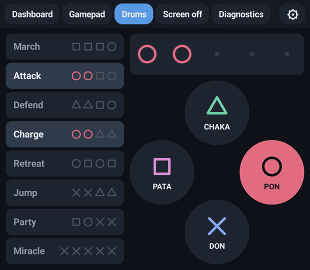
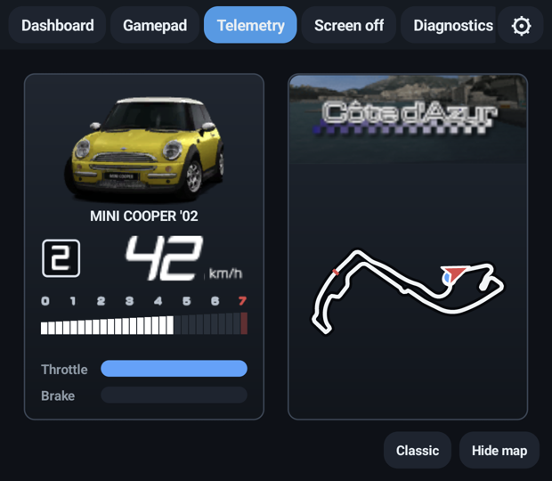
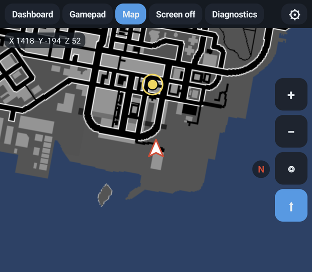
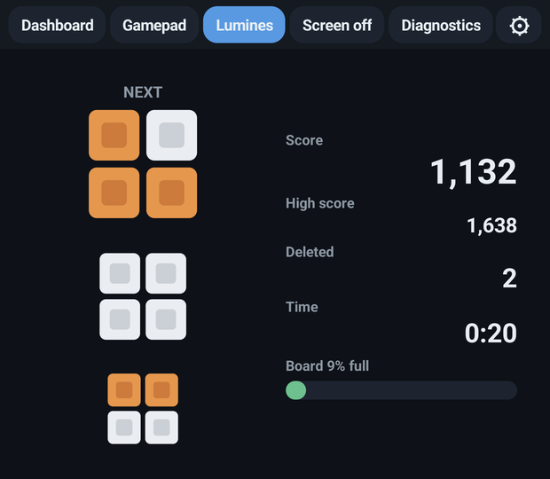

<p align="center">
  
</p>

<h1 align="center">PPSSPP Duo</h1>

<p align="center">
  <b>The PSP emulator PPSSPP, extended for dual-screen Android handhelds such as the AYN Thor.</b><br>
  The game stays on the main screen; the second screen shows a mod: quick actions, a gamepad, or a companion made for the game you're playing.
</p>

<p align="center">
  <a href="https://github.com/mkaflowski/PPSSPP-Duo/releases"></a>
  <a href="https://github.com/mkaflowski/PPSSPP-Duo/releases/latest"></a>
  
  <a href="LICENSE.TXT"></a>
</p>

> **No games are included.** This repository and its releases contain only the emulator. Use your
> own, legally purchased games (dumped from your own UMDs or bought digitally).

## Based on PPSSPP

PPSSPP Duo is a fork of [**PPSSPP**](https://github.com/hrydgard/ppsspp), the PSP emulator by
Henrik Rydgård and the PPSSPP team ([ppsspp.org](https://www.ppsspp.org/)). All the emulation is
theirs; Duo adds the second screen. It installs as a separate app (`org.ppsspp.ppssppduo`), next to
regular PPSSPP. The original README is in [README-PPSSPP.md](README-PPSSPP.md).

If you like the emulator, consider supporting the original project with
[PPSSPP Gold](https://www.ppsspp.org/buygold).

## Games with a dual-screen mod

When one of these games starts, its mod opens on the second screen by itself.

| Game | Mod | On the second screen | Tested with |
|---|---|---|---|
| **Patapon** | Drums | Big PATA / PON / CHAKA / DON drum pads (with the game's own drum artwork, or a classic look) and a song book that lights up as you drum, physical buttons included | UCES00995 (EU) |
| **Patapon 2** | Drums | The same drum pads and song book, with Patapon 2's songs | UCES01177 v1.00 (EU) |
| **Grand Theft Auto: Liberty City Stories** | Map | The whole city map (built from the game's own radar), your position and heading, the route you drove, mission targets and destinations, heading-up rotation | ULES00151 v3.00 (EU) |
| **Lumines: Puzzle Fusion** | Lumines | Big preview of the next blocks, score, high score, squares deleted, time and how full the board is | ULES00043 v1.01 (EU) |
| **Gran Turismo** | Telemetry | Speed, tachometer with the car's red line, gear, throttle and brake in the game's own HUD style, your car's picture, and the whole track with its logo and every car on it (or a plain look) | UCES01245 v2.00 (EU) |
| **Metal Gear Ac!d** | Cards | Your hand of cards as the game draws them (with their illustrations), big and readable, with the full text of the card under the cursor; tap a card to move the game's cursor to it. Snake's life, deck, cost and turn | ULUS10006 v1.00 (US) |
| **Jeanne d'Arc** | Battle | Your party and the enemies with HP, MP and level, and the turn number, drawn like the game's status window with its portraits and lettering (the defeated in black and white, guests tagged) | UCUS98700 v1.00 (US) |
| **WipEout Pure** | Race | Position, lap, speed with the HUD's speed bar, shield energy, race and lap times (last and best), and a map of the track that draws itself from where every ship has been, all in the game's own HUD lettering | UCUS98612 v2.00 (US) |

Other releases of these games are recognized too, and the mods look up the game data at runtime
rather than relying on fixed addresses, but only the versions above have been tested. Jeanne d'Arc,
Metal Gear Ac!d and WipEout Pure are the exceptions: their mods only support the US release.

<p align="center">
  
  
  
  
</p>

## Mods for every game

- **Dashboard**: game icon and title, FPS and speed, clock and battery, save/load state with a
  slot picker, fast forward, alternative speed, rewind, pause menu, pause, screenshot, mute.
- **Gamepad**: every PSP button and the analog stick, multi-touch.
- **Screen off**: a black screen with the tabs hidden, to save power.
- **Diagnostics**: emulator status, display info and a memory view, for mod developers.

Switch mods with the tabs at the top of the second screen; the choice is remembered per game. The
gear tab has the settings (default mod, haptics, which display to use).

## Install

1. Download the APK from [Releases](https://github.com/mkaflowski/PPSSPP-Duo/releases).
2. Install it. It doesn't replace regular PPSSPP.
3. Start a game. The second screen turns on by itself on dual-screen devices; on a single-screen
   phone the app works like plain PPSSPP.

The second screen can be turned off in **Settings → System → Use second screen**, or with the
button at the bottom of its own settings page.

## Building

```
gradlew :android:assembleDuoOptimized
```

Use the `duoOptimized` (or `duoRelease`) variant for playing. `duoDebug` builds the emulator
without optimizations: heavy games such as GTA run at about half speed with it.

## Writing a mod

A mod is one Java class: it builds Android views for the second screen and reads the emulator
through a small API (buttons, virtual keys, game status, memory watches, signature scans, reading
files from the game disc). See [docs/ppsspp-duo.md](docs/ppsspp-duo.md).

## License

GPL v2 or later, like PPSSPP. See [LICENSE.TXT](LICENSE.TXT).
